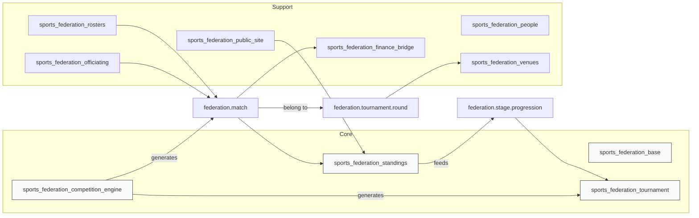

# Sports Federation — Odoo Addons (Odoo 19)

Lightweight collection of Odoo 19 addons to manage a sports federation: clubs,
teams, seasons, tournaments, scheduling, officiating, rosters, results,
standings, portal pages and reporting.

This repository contains modular, opinionated addons under `odoo/` named
`sports_federation_<domain>` (e.g. `sports_federation_tournament`). The code is
designed for clarity: algorithmic logic lives in `services/`, interactive flows
use `wizards/`, and persistent objects in `models/`.

Table of contents
- Architecture overview
- Quickstart / Installation
- Development & tests
- Contributing & docs
- Module list (high level)

Quick links
- High-level context: `odoo/CONTEXT.md`
- Technical notes: `odoo/TECHNICAL_NOTE.md`
- Architecture decisions: `odoo/adr/README.md`
- Route inventory: `odoo/ROUTE_INVENTORY.md`
- Compatibility inventory: `odoo/COMPATIBILITY_INVENTORY.md`
- Release runbook: `odoo/RELEASE_RUNBOOK.md`
- Release train: `odoo/RELEASE_TRAIN.md`
- Module owners: `odoo/MODULE_OWNERS.yaml`
- Integration contracts: `odoo/INTEGRATION_CONTRACTS.md`
- Managed integration OpenAPI: `odoo/openapi/integration_v1.yaml`
- Workflows: `odoo/_workflows/WORKFLOW_TOURNAMENT_LIFECYCLE.md`
- Contributor guide: `CONTRIBUTING.md`

**Architecture overview**

High-level architecture (graph):



Notes:
- The `competition_engine` contains deterministic scheduling services (round-
  robin, knockout). It supports per-round scheduling, round-owned date/venue
  planning, and
  full-bracket construction.
- `federation.tournament.round` is the shared schedule block for a stage: rounds
  own the calendar date and venue, while matches keep the exact kickoff time.
- Standings computation and `stage_progression` rules automate advancement
  across stages (optional `auto_advance`). See `odoo/TECHNICAL_NOTE.md`.

Quickstart / Installation (example)

Prerequisites
- Python 3.10+ (for local linting and editor tooling)
- Docker with Compose v2 (for the containerized Odoo test runner)
- PostgreSQL 12+ only if you are running against a separate local Odoo checkout
- Node.js/npm (optional: for asset tooling)
- wkhtmltopdf (optional: PDF export)

Example (local development on Windows / Powershell):

```powershell
git clone REPOSITORY_URL
cd REPO_ROOT/odoo
python -m venv .venv
.\.venv\Scripts\Activate.ps1
python -m pip install --upgrade pip
python -m pip install -r requirements.txt
black --check sports_federation_base sports_federation_tournament sports_federation_standings sports_federation_venues sports_federation_portal sports_federation_public_site ci
flake8 sports_federation_base sports_federation_tournament sports_federation_standings sports_federation_venues sports_federation_portal sports_federation_public_site ci
```

Containerized module tests (Git Bash / WSL on Windows, or any POSIX shell):

```bash
cp ci/.env.example ci/.env
bash ./ci/run_tests.sh --module sports_federation_standings
bash ./ci/run_tests.sh --suite competition_core
bash ./ci/run_tests.sh --suite portal_public_ops
```

Validate CI helper scripts before pushing changes:

```bash
bash -n ci/run_tests.sh
bash -n ci/apply_env_to_ir_config.sh
```

Notes and tips
- `requirements.txt` pins repository-local tooling only. The Odoo runtime used by CI comes from the `odoo:19` Docker image declared in `ci/docker-compose.ci.yaml`.
- Keep local runtime credentials in `ci/.env`; do not commit that file. The checked-in `ci/.env.example` is the safe template.
- This repository does not ship `odoo-bin`. If you use a separate local Odoo checkout, point its `addons_path` at this repository and run tests from that checkout.
- Use the module manifest `__manifest__.py` `data` entries to register new
  views/security/data files. If you add or change models, update
  `security/ir.model.access.csv` and include migration notes in the docs.
- To run module tests (example):

```bash
bash ./ci/run_tests.sh --module sports_federation_competition_engine
```

Development & tests
- Keep changes small and focused. Add at least one unit/integration test for
  any change that affects scheduling, standings, or progression logic.
- Where possible put algorithmic code in `services/` and keep models simple.
- Use `wizards/` for interactive, admin-driven flows (preview + confirm).

Contributing & docs
- Always update repository documentation as part of the same change set.
  Update `odoo/TECHNICAL_NOTE.md`, relevant `odoo/_workflows/*` and the
  affected module `README.md` under `odoo/<module>/`.
- Treat `ROUTE_INVENTORY.md`, `COMPATIBILITY_INVENTORY.md`, and
  `RELEASE_RUNBOOK.md` as maintained release documents, not one-off notes.
- Follow the PR checklist in `.github/copilot-instructions.md` and add tests
  for behavioural changes. If you cannot update docs immediately, add a clear
  TODO in the change and notify maintainers.
- The canonical lifecycle and ownership reference for the core records is in
  `STATE_AND_OWNERSHIP_MATRIX.md`.
- Use `CONTRIBUTING.md` for the maintainer workflow: local prerequisites,
  env setup, focused CI suites, and pre-push validation commands.

Module list (high level)
- `sports_federation_base` — master data (clubs, teams, seasons)
- `sports_federation_tournament` — tournaments, stages, groups, matches
- `sports_federation_competition_engine` — scheduling services and wizards
- `sports_federation_standings` — standings computation and publishing
- `sports_federation_rosters` — rosters and match-sheets
- `sports_federation_officiating` — referee registry and assignments
- `sports_federation_venues` — venues, playing areas, and round-level venue scheduling
- `sports_federation_finance_bridge` — finance event helpers
- `sports_federation_public_site` / `sports_federation_portal` — public pages and portal flows
