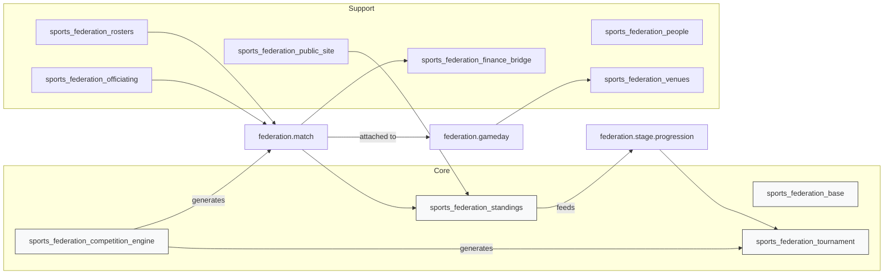

# Sports Federation — Odoo Addons (Odoo 19)

Lightweight collection of Odoo 19 addons to manage a sports federation: clubs,
teams, seasons, tournaments, scheduling, officiating, rosters, results,
standings, portal pages and reporting.

This repository contains modular, opinionated addons under `odoo/` named
`sports_federation_<domain>` (e.g. `sports_federation_tournament`). The code is
designed for clarity: algorithmic logic lives in `services/`, interactive flows
use `wizards/`, and persistent objects in `models/`.

Table of contents
- Architecture overview
- Quickstart / Installation
- Development & tests
- Contributing & docs
- Module list (high level)

**Architecture overview**

High-level architecture (graph):



Notes:
- The `competition_engine` contains deterministic scheduling services (round-
  robin, knockout). It supports per-round scheduling, `gameday` bundling and
  full-bracket construction.
- `federation.gameday` groups matches for a venue/day to simplify operations
  (referees, volunteers, venue finance events).
- Standings computation and `stage_progression` rules automate advancement
  across stages (optional `auto_advance`). See `odoo/TECHNICAL_NOTE.md`.

Quick links
- High-level context: `odoo/CONTEXT.md`
- Technical notes: `odoo/TECHNICAL_NOTE.md`
- Workflows: `odoo/_workflows/WORKFLOW_TOURNAMENT_LIFECYCLE.md`

Quickstart / Installation (example)

Prerequisites
- Python 3.10+ (use virtualenv)
- PostgreSQL 12+
- Node.js/npm (optional: for asset tooling)
- wkhtmltopdf (optional: PDF export)

Example (local development on Windows / Powershell):

```powershell
git clone REPOSITORY_URL
cd REPO_ROOT/odoo
python -m venv .venv
.\.venv\Scripts\Activate.ps1
pip install -U pip setuptools
pip install -r requirements.txt
python odoo-bin -d sports_fed --addons-path=addons,odoo -u all
```

Notes and tips
- Use the module manifest `__manifest__.py` `data` entries to register new
  views/security/data files. If you add or change models, update
  `security/ir.model.access.csv` and include migration notes in the docs.
- To run module tests (example):

```powershell
python odoo-bin -d test_db -i sports_federation_competition_engine --test-enable --stop-after-init
```

Development & tests
- Keep changes small and focused. Add at least one unit/integration test for
  any change that affects scheduling, standings, or progression logic.
- Where possible put algorithmic code in `services/` and keep models simple.
- Use `wizards/` for interactive, admin-driven flows (preview + confirm).

Contributing & docs
- Always update repository documentation as part of the same change set.
  Update `odoo/TECHNICAL_NOTE.md`, relevant `odoo/_workflows/*` and the
  affected module `README.md` under `odoo/<module>/`.
- Follow the PR checklist in `.github/copilot-instructions.md` and add tests
  for behavioural changes. If you cannot update docs immediately, add a clear
  TODO in the change and notify maintainers.

Module list (high level)
- `sports_federation_base` — master data (clubs, teams, seasons)
- `sports_federation_tournament` — tournaments, stages, groups, matches
- `sports_federation_competition_engine` — scheduling services and wizards
- `sports_federation_standings` — standings computation and publishing
- `sports_federation_rosters` — rosters and match-sheets
- `sports_federation_officiating` — referee registry and assignments
- `sports_federation_venues` — venues, gamedays and venue helpers
- `sports_federation_finance_bridge` — finance event helpers
- `sports_federation_public_site` / `sports_federation_portal` — public pages and portal flows

License & maintainers
- Add your project license here and a maintainers section if applicable.

---
If you'd like, I can commit this `README.md` and open a draft PR, or refine
the architecture diagram into a rendered image and embed it — which would you
prefer?
